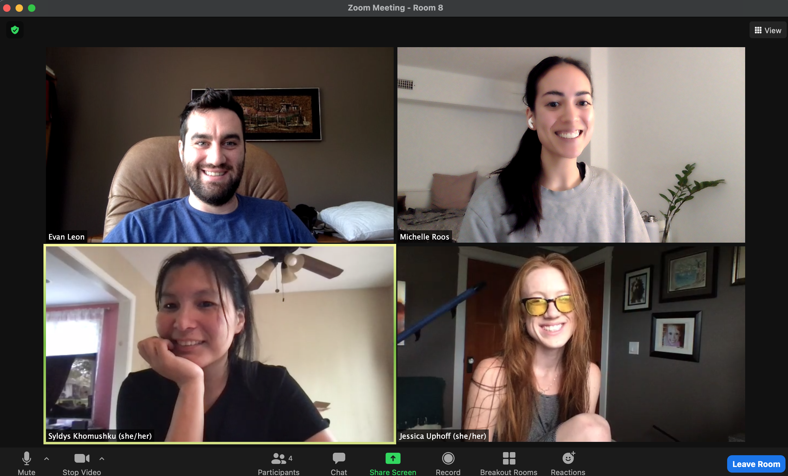

# Flux

## About
Flux is a travel planner that solves two common trip challenges; the dates and the destination. Users can initiate a travel plan and invite participants to join. Collaborators can nominate suggestions and upvote, downvote and comment on others’ suggestions. 

Demo Flux [here](https://state-of-flux.herokuapp.com/).

## Architecture and Technology

Flux is built using the MERN stack which consists of MongoDB Atlas as a NoSQL database, Express.js as a framework for Node.js, and React/Redux for state management. Mongoose is used as an Object Data Modeling (ODM) Library for MongoDb and Node.js. A Gmail API is used to interact with users' Gmail inboxes. Flux is styled using SCSS. 

## Available Scripts

In the project directory, you can install dependencies by running:

```sh
npm install
```

Start the server by running:

```sh
npm run dev
```

Open [http://localhost:3000](http://localhost:3000) to view it in the browser.

# Notable Features
## Inviting participants
Flux allows users to invite participants to join their travel plan. Emails are sent using the Nodemailer module as a transporter combined with the Google server. Start by installing [Nodemailer](https://www.npmjs.com/package/nodemailer) and setting up your backend route using [Express](https://expressjs.com/). Set up oAuth and security using Google Cloud Console and use [Passport and JWT](http://www.passportjs.org/packages/passport-jwt/) to access the current user. [This](https://www.youtube.com/watch?v=-rcRf7yswfM) is a very helpful YouTube tutorial on integrating OAuth2 and Nodemailer.

```sh
const React = require("react");

const express = require("express");
const router = express.Router();

var nodemailer = require('nodemailer');
var { google } = require('googleapis');

const passport = require('passport');
const jwt = require('jsonwebtoken');
const keys = require('../../config/keys');

const CLIENT_ID = require('../../config/keys').google_client_id;
const CLIENT_SECRET = require('../../config/keys').google_client_secret;
const REDIRECT_URI = require('../../config/keys').google_redirect_uri;
const REFRESH_TOKEN = require('../../config/keys').google_refresh_token;

const oAuth2Client = new google.auth.OAuth2(CLIENT_ID, CLIENT_SECRET, REDIRECT_URI);
oAuth2Client.setCredentials({ refresh_token: REFRESH_TOKEN });

router.post('/:id/send',
    passport.authenticate('jwt', { session: false }),
    (req, res) => {

        async function sendMail() {
            try {
                const accessToken = await oAuth2Client.getAccessToken();

                const transport = nodemailer.createTransport({
                    service: 'gmail',
                    auth: {
                        type: 'OAuth2',
                        user: 'stateoffluxapp@gmail.com',
                        clientId: CLIENT_ID,
                        clientSecret: CLIENT_SECRET,
                        refreshToken: REFRESH_TOKEN,
                        accessToken: accessToken,
                    },
                });

                const user = req.user.firstName.slice(0, 1).toUpperCase() + req.user.firstName.slice(1);
                const planId = req.params.id;
                const email = req.body.email;
                
                const mailOptions = {
                    from: 'FLUX ☀️🌴 <stateoffluxapp@gmail.com>',
                    to: email,
                    subject: `${user} wants to go on a trip with you ✈️`,
                    text: `${user} has invited you to join their travel plan on Flux. Please join the plan at https://state-of-flux.herokuapp.com/#/${planId}.`
                };

                const result = await transport.sendMail(mailOptions);
                return result;

            } catch (error) {
                return error;
            }
        }

        sendMail()
            .then(mail => res.json(mail))
            .catch((error) => console.log(error.message));

    });

module.exports = router;
```

## Authors
* Evan Leon - Backend Lead 
    * [GitHub](https://github.com/Evan-Leon)
    * [LinkedIn](https://www.linkedin.com/in/evan-leon-737918211/)
* Jessica Uphoff - Flex & Design Lead
    * [GitHub](https://github.com/jessicaUP)
    * [LinkedIn](https://www.linkedin.com/in/jessica-uphoff-b2584b69/)
* Michelle Roos - Team Lead
    * [GitHub](https://github.com/helloroos)
    * LinkedIn - WIP
* Syldys Khomushku Frontend Lead
    * [GitHub](https://github.com/syldysnya)
    * [LinkedIn](https://www.linkedin.com/in/syldysvkhomushku/)

 
 <!--  -->
